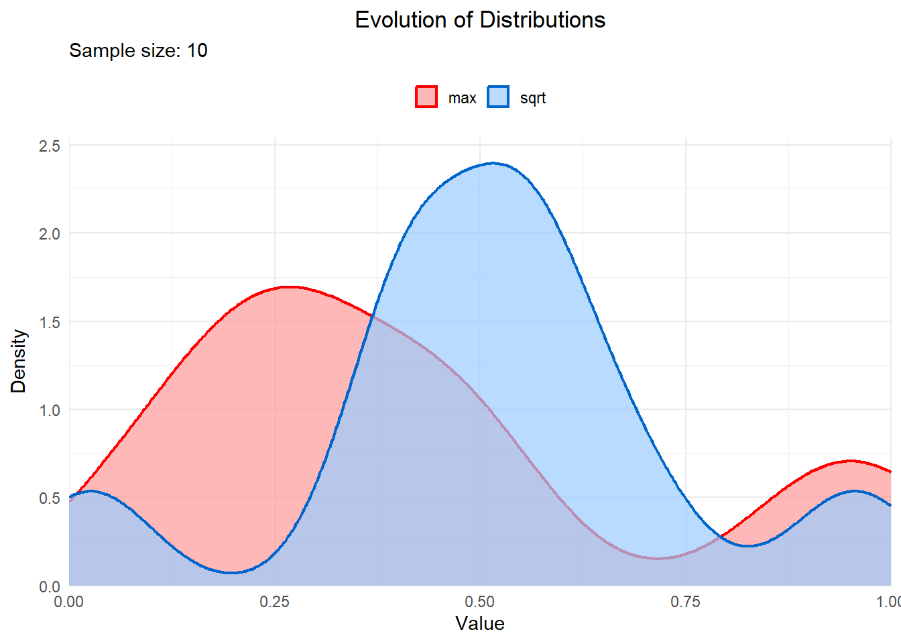

I recently came across a [YouTube Short](https://www.youtube.com/shorts/Pny70rNPJLk) by Grant Sanderson, and I have to say, it blew my mind! The idea that the distributions describing the result of the maximum of two random numbers and the square root of one of those numbers are the same is simply too good to be true. His explanation in the video is pure brilliance!

Inspired by this, I decided to write a quick R script to simulate both of these processes and compare their distributions.

```{r}
library(tidyverse) 
```


```{r}
n_samples <- 100000

# Generate 100,000 pairs of random numbers between 0 and 1
rand_pairs <- replicate(n_samples, runif(2, min = 0, max = 1))

# Calculate the maximum of each pair
max_rand <- apply(rand_pairs, 2, max)

# Calculate the square root of a randomly selected number from each pair
sqrt_rand <- apply(rand_pairs, 2, function(x) sqrt(sample(x, 1)))
```


```{r}
# Plot the density of both distributions
ggplot() +
  geom_density(aes(x = max_rand, fill = "Max()", color = "Max()"), alpha = 0.5, linewidth = 1) +
  geom_density(aes(x = sqrt_rand, fill = "Square Root", color = "Square Root"), alpha = 0.5, linewidth = 1) +
  labs(title = "Comparing Distributions of Max() and Square Root", 
       x = "Value", 
       y = "Density",
       fill = "Function",
       color = "Function") +
  theme_minimal(base_size = 14) +
  theme(legend.position = "top",
        legend.background = element_rect(fill = "white", color = NA),
        legend.key = element_rect(fill = NA, color = NA),
        legend.title = element_blank(),
        plot.title = element_text(hjust = 0.5)) +
  scale_fill_manual(values = c("Max()" = "#FF9999", "Square Root" = "#99CCFF")) +
  scale_color_manual(values = c("Max()" = "#FF0000", "Square Root" = "#0066CC")) +
  coord_cartesian(xlim = c(0, 1), expand = FALSE)
```


### Why This is So Cool

What I love about this is that it's not just a random coincidence. There's a beautiful symmetry in how the square root transformation and the maximum function work in tandem to produce the same kind of distribution. It’s a reminder of how interconnected different concepts in probability and statistics can be, and it really made me appreciate the elegance of randomness!

